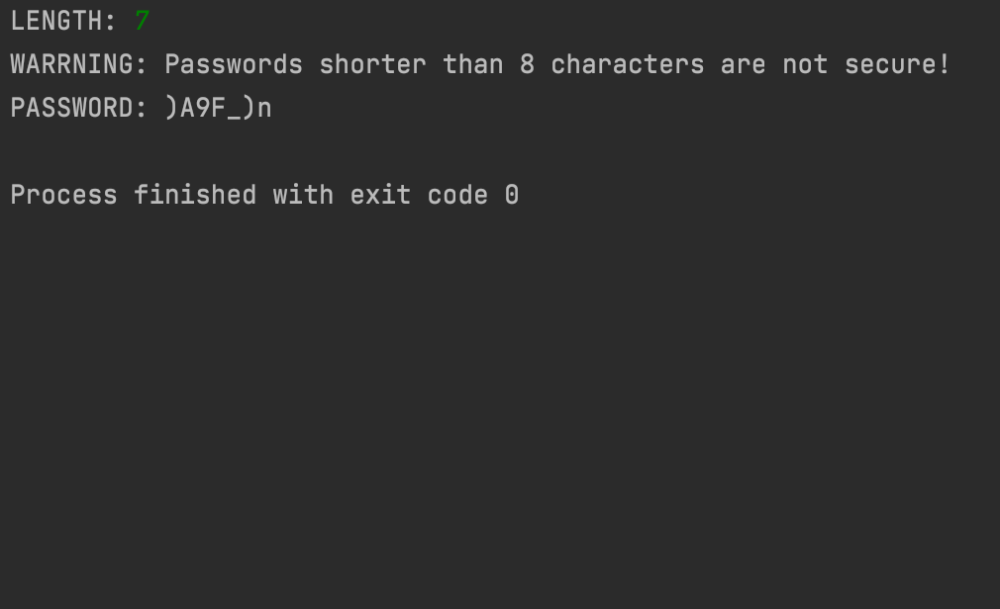

# PASSWORDGENERATOR
Simple tool that generates passwords that include at least one digit, special character, lowercase and uppercase letter. This program also warns you, when your password is shorter than 8 characters. Developer assume no liability and is not responsible for any damage caused by PASSWORDGENERATOR. 
 

# Usage
1. Run the script
2. Input length of the password you want to generate (must be equal or greater than 4 and should be at least 8)
3. Generated password will be shown in console

# Legal
I assume no liability and I am not responsible for any misuse or damage caused by my software. You are using my software at your own risk!

# Author
Filip Rokita 
www.filiprokita.com
